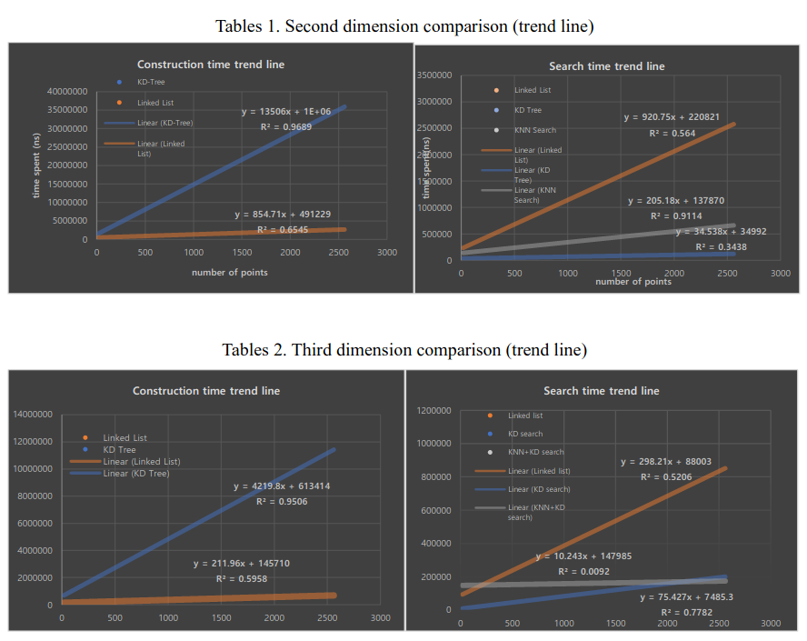

# 
 RangeSearchAnalysis 

## 
 Algorithm of Analysis - KD-Tree/KNN algorithm.

 Florida Tech 2021 Individual Project
 

# Example video

## Analysis Document
[Open with google docs](https://docs.google.com/document/d/1ID8N696E-MqTVcrqqYRdPuos8pG6wsb-/edit?usp=sharing&ouid=116846183481799249714&rtpof=true&sd=true)

## Executable main classes.
 * Main.java
      * Takes integer input based on the input files. If input files are in three dimension, user has to put, for example, [5 10 25] separated by the space(exclude brackets). 
      * Executes sequential construction and KD-KNN-tree construction based on the input files in data with specified file name.
      * If data file for input is empty, CoordinateGen.java execution is required before running Main.java program in order to make arbitrary input files.
      
 * CoordinateGen.java
      * Prompts user to type in the dimension. This will be the initial dimension setup.
      * Prompts user to select a file type - Large points, Small points.

## This project is comprised of three major sections.

For every distance calcuation, Euclidean distance is used.

### 1. Point Generator(**CoordinateGen.java**).

    

  * Generates arbiturary points in random order.
      * Matrix dimesion determined by getting users input.
      * Matrix point range and number of points grow larger.
      * When generated input file name is BIG_DATA_CASE10_20, this means the generated random points have maximum point range from 1 to 10 with number of points of 20. 
      
### 2. Data structures.
  * Linked List (**SequentialAlgorithm.java**).
    * insert(list)
      > Append additional coordinate points to the end  
    * findClosestDistance(targetPoints)
      > Visit every node to verify the shortest distance  
 
  * KD-Tree (**KDTreeIntegers.java**).
    * Class.AxisSort
      > comparator that sorts an ArrayList by axis index
    * insert(depth, listOfPoints, currentNode, parentNode)
      > Builds a binaray-tree like data structure.
    * findKDTreeNormal(targetPoints)
      > finds a approximately close distance to the targetPoints
  
  * KNN-Search (method in **KDTreeIntegers.java**).
    * findKNNAlgorithm(targetPoints, node)
      > find closest distance from the targetPoints with the result node from KD-Tree search

Results from the terminal
  

      
  

### 3. Result exportation.
   
  

      
  

   
   

   * All summary data are exported into .cell file. Data contains:
      > General cell 
      >> Numeric value range.  
      >> Number of points.  
      >> Desired coordinationto look up.  
      
       
        

            
        

       
      
      > Each cell contains
      >> Closest coordinate points found  
      >> Distance value in double  
      >> Construction time consumption in nano seconds  
      >> Search time consumption in nano seconds  

Time is measured by using ProcessTimeRecorder(System.nanoTime).

Graphical data based on the program

    

